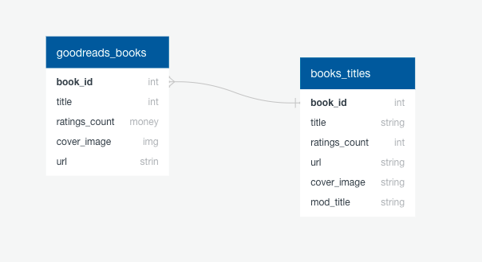

# Reccomend_books
A program using Goodreads data to suggest books to read

# Steps

1) Download data
2) Create a search, make a list of books
3) Create the recommendations 
4) Filter the recommendations

## Download book data
* Go to https://sites.google.com/eng.ucsd.edu/ucsdbookgraph/books
* Download book data from https://drive.google.com/uc?id=1LXpK1UfqtP89H1tYy0pBGHjYk8IhigUK

## Download interaction data
* Go to https://sites.google.com/eng.ucsd.edu/ucsdbookgraph/shelves
* Download https://drive.google.com/open?id=1zmylV7XW2dfQVCLeg1LbllfQtHD2KUon
* Download https://drive.google.com/uc?id=1CHTAaNwyzvbi1TR08MJrJ03BxA266Yxr

### Search Engine

- [Search](./search.ipynb)

Creating a Term Frequency Matrix - takes all the unique words across all titles and turns them into a column in the Matrix

Go through each title - if the word exists in the title, add a 1

Rows are the book titles
Columns are the terms

Inverse Document Frequency - make words that appear infrequently more meaningful.
Log(number_of_titles / number_of_titles_word_appears)

Term Frequency matrix * Inverse Document Frequency matrix

### Recommendations

- [Recommendations](./recommendations.ipynb)

### Collaborative Filtering

1) Find Similar Users
2) Create Matrix
3) Recommend Books

Creating a user/book matrix:

Every row will be a different user, every colum will be a different book, the cells will contain the user's rating of a book

## Further improvements

Create additional Quick Database diagrams
Add the my_ratings file
Add a formatting file for the goodreads_export data

